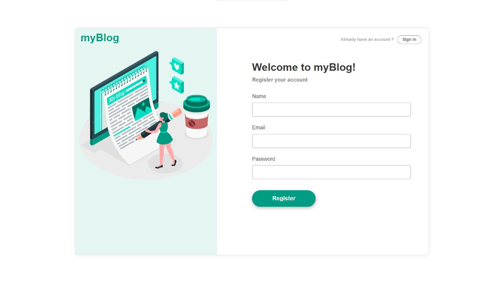
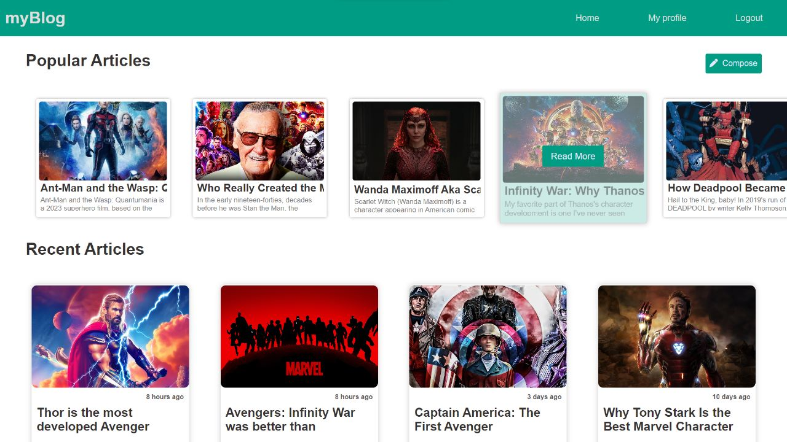
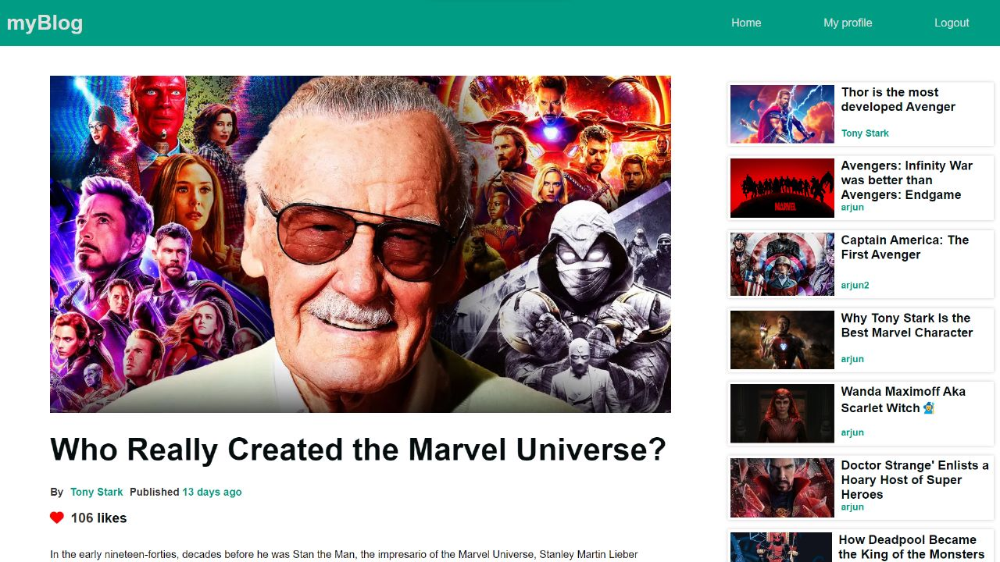
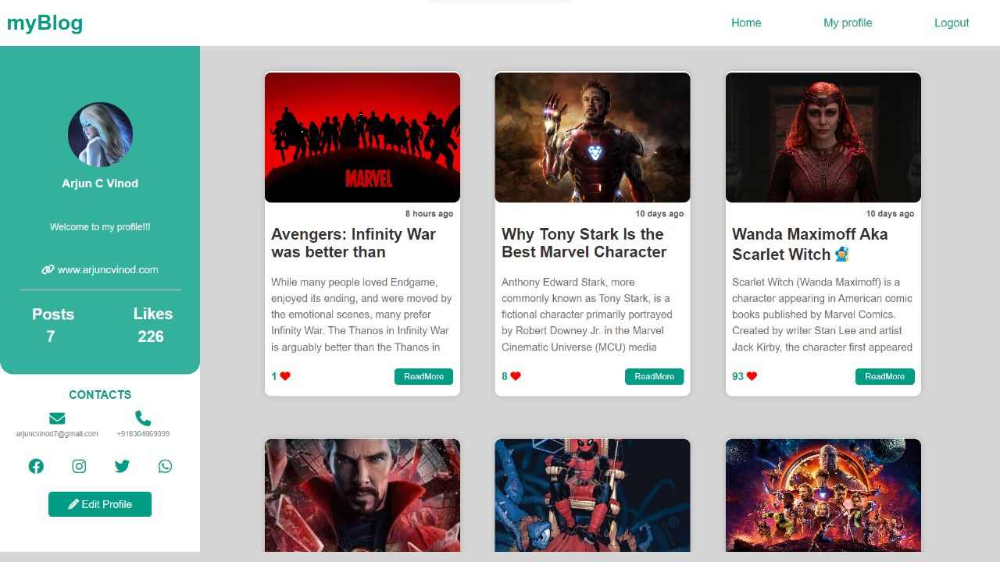

## Blogging-Website

### Languages Used:
#### Front end :   
#### Backend :  
#### Database :  <br />
### Live Preview : [www.myblog.com](https://blogwebsite-1rl3.onrender.com/)
## Installation

### Clone the Repository

```bash
git clone https://github.com/arjuncvinod/Blogging-Website.git
cd Blogging-Website
```
### Install dependencies
```console 
npm install
```
### Start
```console
node src/App.js
```
```sh
The Website will be available at http://localhost:3000
```
 **Screenshots**: 

<h3 align="center"> Login section</h3>

<h3 align="center"> Home Page</h3>

<h3 align="center"> Post View</h3>

<h3 align="center"> Profile Section</h3>

<h3 align="center"> Admin Dashboard </h3>


<h3  align="center" > Don't forget to hit the :star: if you like this repo. </h3>
<h1 align="center"> Made with ❤️ by <a href="https://arjuncvinod.github.io">Arjun</a> </h1>
